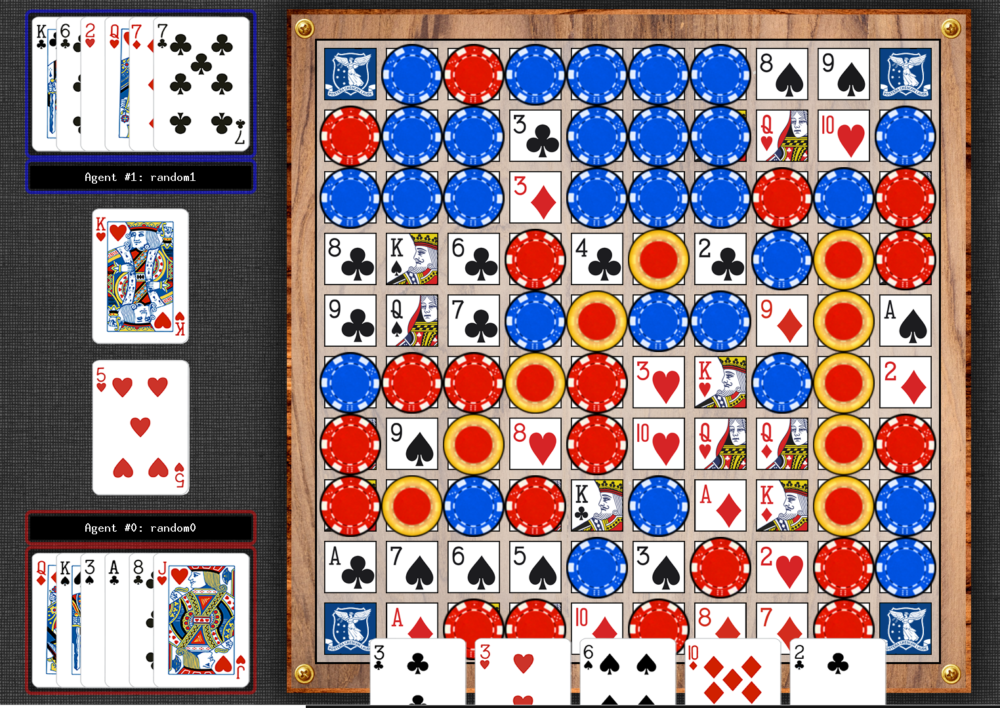

# AI-A3 Sequence Agent

*A hybrid deep reinforcement learning agent for the Sequence board game.*

---

## Description

This project implements an advanced AI agent for the game **Sequence**, designed for the COMP90054 Sequence competition. The agent combines Deep Q-Learning (DQN) with heuristic evaluation to make intelligent, strategic moves. It is intended for students, researchers, and developers interested in game AI, reinforcement learning, and hybrid agent design.

---

## Screenshots

> 



---

## Features

- **Hybrid Decision Making:** Combines DQN-based policy with handcrafted heuristics for robust play.
- **Deep Q-Network:** Neural network models trained to evaluate board states and actions.
- **Heuristic Scoring:** Domain-specific logic to boost strategic moves (e.g., forming sequences, blocking opponents).
- **Flexible Action Mapping:** Dynamically maps game actions to neural network outputs.
- **Model Loading:** Loads pre-trained models for fast inference.
- **Extensible:** Modular codebase for easy experimentation and extension.

---

## Tech Stack

- **Python 3.8+**
- **PyTorch** (Deep Learning)
- **NumPy** (Numerical operations)
- **COMP90054 Sequence Framework** (Game engine and agent interface)

---

## Installation / Setup

Clone the repository and set up the environment:

```sh
git clone https://github.com/deepakbhagatiitr/AI-Planning-for-Autonomy.git
cd AI Planning for Autonomy
pip install -r docker/requirements.txt
```

(Optional) Use Docker for a reproducible environment:

```sh
cd docker
docker build -t sequence-agent .
docker run -it --rm -v $(pwd)/../:/workspace sequence-agent
```

---

## Usage

1. **Implement or modify your agent** in `agents/t_XXX/myTeam.py`.
2. **Run matches** using the provided Sequence game engine:

```sh
python -m Sequence.sequence_runner --agents agents/t_024/myTeam.py agents/generic/first_move.py
```

3. **Train or evaluate models** as needed (see code for details).

---

## Configuration

- **Model Weights:**  
  Place pre-trained model files in `agents/t_094/`:
  - `hybrid_sequence_agent_local.pth`
  - `hybrid_sequence_agent_target.pth`

- **Environment Variables:**  
  *(None required by default. Add here if you introduce any.)*

---

## Contributing

Contributions are welcome! Please follow these steps:

1. Fork the repository.
2. Create a new branch for your feature or fix.
3. Commit your changes with clear messages.
4. Push to your fork and open a Pull Request.

---

## License

[](LICENSE)

This project is licensed under the MIT License.

---

## Author / Acknowledgements

- **Author:** Deepak Bhagat  
  [GitHub](https://github.com/deepakbhagatiitr) | [LinkedIn](https://www.linkedin.com/in/deepakbhagatiitr/)

- **Acknowledgements:**
  - Sequence game framework authors  
  - OpenAI, PyTorch, and NumPy communities